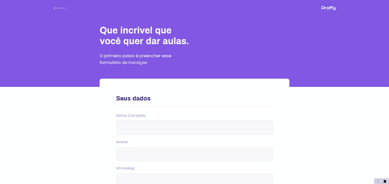
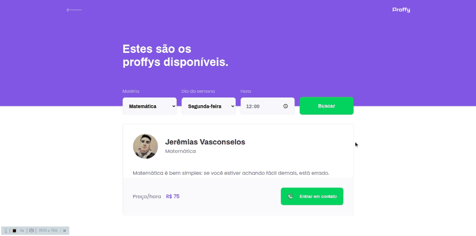
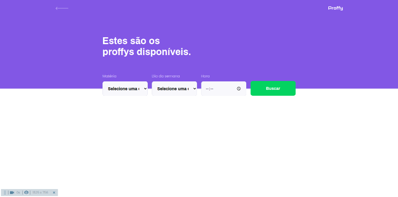
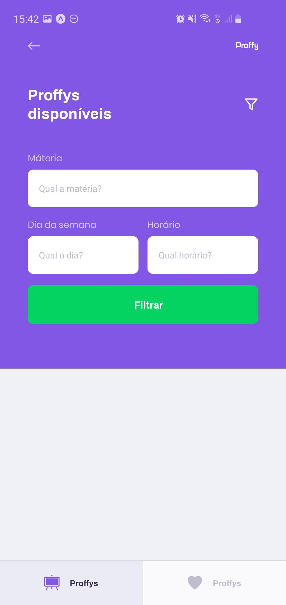
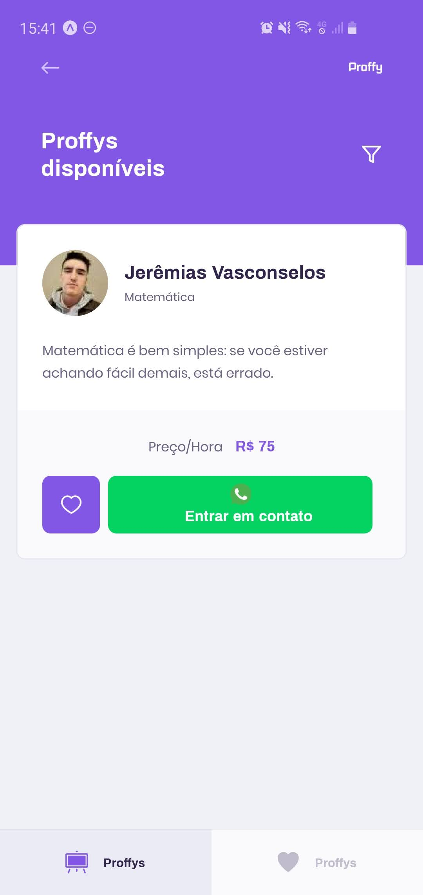
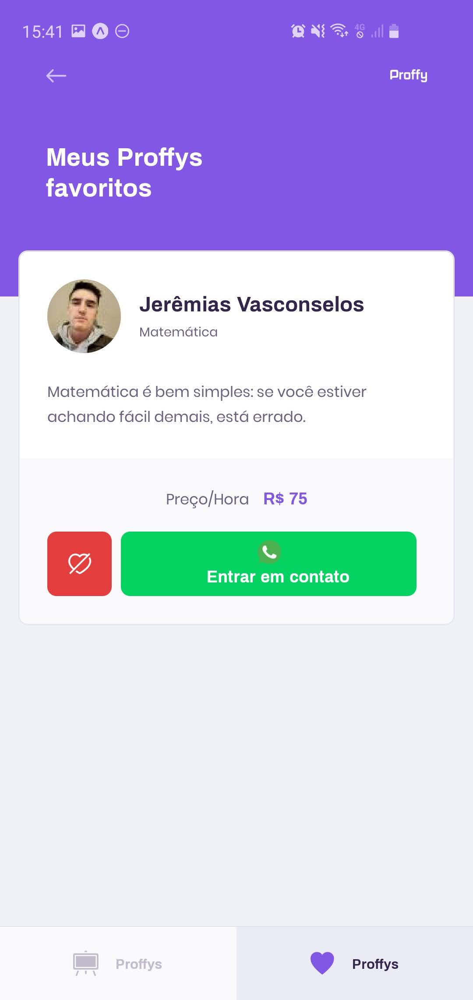

<h1 align="center">
 
  
 
 
Proffy
</h1>
 

Um projeto para conectar professores e estudantes.
 
 
O projeto foi administrado pela <a href="https://rocketseat.com.br/">@Rocketseat </a>na Next Level Week #2

  

## Recursos usados:
[//]: # (Add the features of your project here:)

- ʦ  **Typescript** 
- ⚛️ **React Js** 
- ⚛️ **React Native** 
- 💹 **Node Js**
- 📄 **SQLite**
- ⍓  **Expo**

## Layout

<h3>Web</h3>
  
Landing Page
   
  
  

  
Teacher Form
   
  

  
Teacher List 
   
  
  

  <h3>Mobile</h3>
  
Landing Page
   
  

  
Teacher Form
   
  

  
Teacher List 
   
  
  
  

## Começando

1.  Clone este repo usando git clone `https://github.com/MatheusPetry/nlw-proffy.git`
2.  Mova-se para o diretório apropriado: `cd nlw-proffy`
3.  Execute `yarn` para instalar dependências

## Primeiros passos com o servidor backend

1.  Vá para a pasta backend: `cd server`
2.  Execute `yarn dev` para iniciar o servidor

## Primeiros passos com o aplicativo front-end

1.  Vá para a pasta frontend: `cd web`
2.  Execute `yarn start` para iniciar o aplicativo da web

## Primeiros passos com o aplicativo móvel

1.  Vá para a pasta móvel `cd mobile`
2.  Execute `react-native run-ios` (ou `react-native run android`) para iniciar o aplicativo no emulador ou baixe o aplicativo [Expo](https://play.google.com/store/apps/details?id=host.exp.exponent), leia o QRCode e emule pelo aparelho físico

## Licença

Este projeto está licenciado sob a Licença MIT - consulte a página [LICENSE](https://opensource.org/licenses/MIT) para obter detalhes.
 